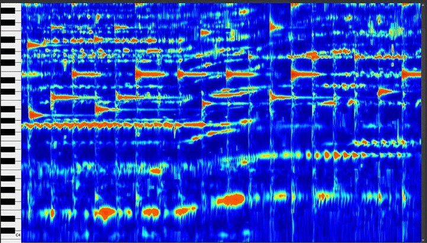

<picture>
  <source media="(prefers-color-scheme: light)" srcset="/docs/spectogram">
  
</picture>

pianotranscription: open-source, dependency-free and fast way to generate piano sheets from audio recordings

<h3>

[Homepage](https://schmxtz.github.io) | [Documentation](https://github.com/schmxtz/pianotranscription) | [Discord](https://discord.gg/96eYjpAgSE)

</h3>

---

I've always been a huge piano music enjoyer. More so on the listening side, than the playing one. But what has always fascinated me the most has been piano sheets and how some people can transcribe music only by ear. I cannot do that, but I always wondered if it is possible for me with computer assistence. 

There has been a software called [Concert Creator AI](https://www.concertcreator.ai/), that worked fascinatingly well. Unfortunately they charged 200$/month and eventually shut down.

There is also this [Github repo](https://github.com/bytedance/piano_transcription), whose AI model is also very good at transcribing music to sheet music. But it's very slow and the sheet music has been in most cases unusable.

So the goal of this repo, to give another shot at tackeling this problem. Written in C without using any dependencies.

--- 

<h1> Overview </h1>

1. Read Audio Files: Write a parser for audio files to extract raw PCM samples.
2. Implement FFT: Write or adapt an efficient FFT algorithm in C.
3. Windowing: Apply a window function (e.g., Hamming or Hanning) to each audio segment to reduce spectral leakage.
4. Spectrogram: Process the audio in overlapping chunks, compute the FFT, and store the magnitude spectrum.
5. Optimization
6. Output: Visualize or save the spectrogram (e.g., as text, a CSV, or an image).
7. Sheet generation: Based on given parameters (key, tempo, etc) have the sheets automatically generate

---

# TODO

### Audio parser
- [ ] Read file into memory  
  - [x] Read wave-header chunk
    - [ ] support RIFX header
    - [ ] support data format other than PCM (e.g. IEEE float)
  - [x] Read the remaining chunk types
    - [ ] Associated data list chunk
    - [x] Data chunk
- [ ] FFT implementation
  - [ ]

 
